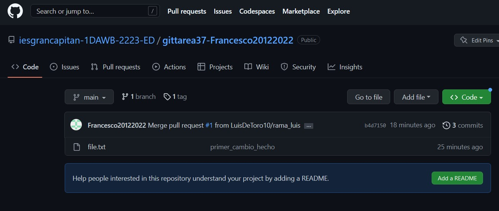

# Tarea Git 3.6

### Creo un fork con el compañero.

### Creo una carpeta, hago un git init y clone del repositorio fork y creo una nueva rama

### Creo un archivo de texto

### Entro en el repositorio del compañero

### Creo un pull request

### Pull request

### Cambio en el archivo 

### Recibo cambio del compañero

### Hago un merge

### Merge correcto

### Creo un tag

### Tag
